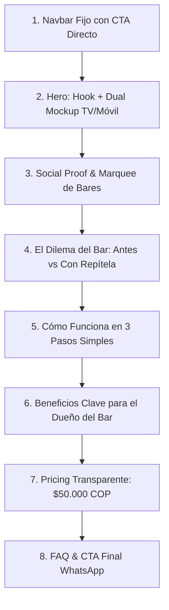

# Repítela — Documento de Diseño y Especificación Visual de la Landing Page
**Versión:** 2.0  
**Fecha de actualización:** 2026-08-14  
**Proyecto:** Repítela (`landing/`)  
**Audiencia Objetivo:** Dueños, administradores y gerentes de bares, discotecas, gastrobares y eventos en Colombia y Latinoamérica.

---

## 1. Visión y Propósito del Rediseño

### 1.1 El Problema Actual de la Landing
1. **Estética Genérica:** Usa un fondo oscuro con tonos púrpuras genéricos (`hsl(252 85% 68%)`) y una foto de stock estática en el Hero en lugar de mostrar la interfaz real y el valor tangible del producto.
2. **Falta de Demostración Visual:** El cliente no "ve" la magia del producto en acción: cómo se conecta el celular del cliente con la pantalla del bar (Kiosk TV) en tiempo real.
3. **Copy Desenfocado:** No cuantifica el retorno de inversión (ROI) para el dueño del bar (aumento de permanencia, consumo por mesa y satisfacción del cliente).
4. **Falta de Interactividad:** La landing carece de componentes vivos (simulador interactivo, ecualizadores de audio animados, mockups sincronizados) que transmitan la atmósfera nocturna y musical.

### 1.2 Objetivos de Diseño
- **Transmitir "Nightlife Tech & Modern Vibe":** Una estética oscura, elegante y premium inspirada en los mejores locales nocturnos, con acentos vibrantes de color (Neón Sunset / Ámbar Eléctrico / Púrpura Profundo) y tipografía moderna con personalidad.
- **Mostrar el Producto Real (Show, Don't Tell):** Reemplazar fotos de stock por mockups interactivos duales: **Celular del Cliente (App Web)** ↔ **Pantalla Kiosk del Bar (TV 16:9)**.
- **Optimizar la Conversión B2B:** Facilitar la contratación directa a través de WhatsApp ($50.000 COP/mes) y generar confianza inmediata con cifras claras, ROI y configuración en 3 minutos.
- **Experiencia Móvil Impecable:** +70% del tráfico B2B abrirá la web desde Instagram/WhatsApp en su smartphone. El diseño debe ser 100% fluido y responsive.

---

## 2. Sistema de Diseño (Design System Tokens)

### 2.1 Paleta de Color (Tailwind & CSS Variables)
Inspirada en el ambiente de bar nocturno: obsidian, contrastes precisos, acentos de neón energéticos y legibilidad WCAG AAA.

| Token | HSL / Hex | Uso |
| :--- | :--- | :--- |
| **`--background`** | `240 18% 4%` (`#07070B`) | Fondo general de la página (Obsidian profundo) |
| **`--card`** | `240 16% 7%` (`#0E0E14`) | Tarjetas, contenedores y paneles |
| **`--card-hover`** | `240 14% 11%` (`#161620`) | Estado hover de tarjetas |
| **`--border`** | `240 12% 16%` (`#1F1F2C`) | Bordes sutiles y separadores |
| **`--foreground`** | `0 0% 98%` (`#FAFAFA`) | Texto principal de alto contraste |
| **`--muted-foreground`** | `240 6% 62%` (`#9999A8`) | Textos secundarios y descripciones |
| **`--primary` (Electric Orange/Amber)** | `16 100% 60%` (`#FF5522`) | CTA Principal, botones de acción, highlights |
| **`--primary-glow`** | `16 100% 60% / 0.25` | Resplandor suave de botones y badges |
| **`--accent-cyan` (Neon Blue)** | `195 100% 50%` (`#00C8FF`) | Estado "En Vivo / Reproduciendo", badges de audio |
| **`--accent-purple` (Deep Violet)** | `270 85% 65%` (`#A855F7`) | Gradientes complementarios y detalles visuales |
| **`--success` (Emerald)** | `142 76% 45%` (`#16A34A`) | Verificaciones, checkmarks de pricing y garantías |

#### Gradientes Oficiales
```css
/* Gradiente de Marca para Títulos */
.text-gradient-brand {
  background: linear-gradient(135deg, #FF6B35 0%, #FF2A6D 50%, #9D4EDD 100%);
  -webkit-background-clip: text;
  -webkit-text-fill-color: transparent;
}

/* Gradiente de Acento Sutil para Fondos */
.bg-glow-radial {
  background: radial-gradient(circle at 50% 20%, rgba(255, 85, 34, 0.12) 0%, rgba(157, 78, 221, 0.05) 50%, transparent 80%);
}
```

---

### 2.2 Tipografía y Jerarquía
- **Display / Headings:** `Plus Jakarta Sans` o `Outfit` (fuente sans-serif moderna, geométrica y con peso contundente en 700 y 800).
- **Body & Data:** `Inter` o `Geist` (legibilidad absoluta en cuerpos de texto pequeños y números de estadísticas).

| Nivel | Tamaño (Desktop / Mobile) | Peso | Tracking | Uso |
| :--- | :--- | :--- | :--- | :--- |
| **H1 (Hero)** | `4.25rem (68px)` / `2.5rem (40px)` | 800 (Extrabold) | `-0.03em` | Título principal del Hero |
| **H2 (Sección)** | `2.75rem (44px)` / `2.0rem (32px)` | 700 (Bold) | `-0.02em` | Encabezados de cada sección |
| **H3 (Card Title)** | `1.35rem (22px)` / `1.2rem (19px)` | 600 (Semibold) | `-0.01em` | Títulos de características y pasos |
| **Body Large** | `1.125rem (18px)` / `1.0rem (16px)` | 400 (Regular) | `normal` | Párrafos introductorios |
| **Body Small** | `0.875rem (14px)` / `0.8125rem (13px)`| 400 (Regular) | `normal` | Textos de apoyo, badges y notas |

---

### 2.3 Estilos de Superficie y Efectos
1. **Glassmorphism Refinado:**
   ```css
   .repitela-card {
     background: rgba(14, 14, 20, 0.7);
     backdrop-filter: blur(16px);
     -webkit-backdrop-filter: blur(16px);
     border: 1px solid rgba(255, 255, 255, 0.08);
     box-shadow: 0 8px 32px 0 rgba(0, 0, 0, 0.37);
     border-radius: 1.25rem;
   }
   ```
2. **Ecualizador de Audio Animado (Micro-interacción de cabecera):**
   Barritas de sonido verticales que oscilan con CSS animations para dar sensación de música sonando en vivo.
3. **Bordes con Iluminación Reactiva:**
   En hover, el borde pasa suavemente de `border-white/10` a `border-primary/40` con una transición de `300ms cubic-bezier(0.4, 0, 0.2, 1)`.

---

## 3. Estructura y Wireframe de la Landing Page

La página se organiza en **9 secciones estratégicas**, optimizadas para el embudo de conversión B2B:



---

### Detalle por Sección:

### Sección 1: Navbar
- **Logo:** Icono de nota musical + tipografía "Repítela" con badge `V2.0`.
- **Links de navegación:**
  - ¿Cómo funciona? (`#como-funciona`)
  - Para tu Bar (`#para-bares`)
  - Simulador (`#simulador`)
  - Precios (`#precio`)
  - Preguntas (`#faq`)
- **Acceso Clientes / Admin:** Enlace discreto "Ingresar a mi Bar" (`https://app.repitela.com/admin`).
- **CTA Destacado:** Botón `Activar mi Bar — $50k/mes`.

---

### Sección 2: Hero Section (Impacto & Dual Mockup)
- **Badge Superior:** `🔥 El Jukebox Digital #1 para Bares en Colombia` (con icono de fuego y pulso de audio).
- **Titular (H1):**
  > **La música la ponen tus clientes.**  
  > <span class="text-gradient-brand">El control y las ganancias, tú.</span>
- **Subtítulo:**
  > Tus clientes escanean el QR de la mesa, buscan su canción favorita de YouTube y la encolan al instante. Tu televisor reproduce los videos sin publicidad y tu bar se llena de energía.
- **Acciones (CTAs):**
  - **Botón Primario:** `🚀 Empezar prueba gratis (WhatsApp)`
  - **Botón Secundario:** `▶ Ver cómo funciona (30s)` o `Probar simulador`
- **Métricas Rápidas:**
  - ⚡ **0 descargas:** Funciona directo en el navegador web móvil.
  - ⏱️ **Setup en 3 min:** Solo necesitas una pantalla o Smart TV con navegador.
  - 🚫 **Cero silencios:** Playlist de respaldo automática cuando la cola se vacía.
- **Visual Hero (Dual Mockup Interactivo):**
  - **Izquierda/Centro (Laptop/TV Kiosk):** Mockup de pantalla 16:9 con video de YouTube simulado, barra de progreso personalizada, logo del bar en la esquina, indicador "Sonando ahora: Shakira - Te Felicito", y un mini QR animado de escaneo.
  - **Derecha (Móvil del Cliente en perspectiva):** Mockup de iPhone mostrando la barra de búsqueda "Buscar canción en YouTube...", lista de canciones en cola con avatars de los clientes en cada mesa y botón "Pedir Canción".

---

### Sección 3: Social Proof & Bares en Vivo
- **Ticker / Marquee animado:**
  "Sonando ahora en más de 45 bares y gastrobares en Bogotá, Medellín, Cali y Cartagena 🇨🇴".
- **Tarjetas de Estadísticas Clave:**
  - **+35%** en tiempo promedio de permanencia por mesa.
  - **4.9/5** estrellas de satisfacción de clientes.
  - **>120.000** canciones reproducidas sin interrupciones.

---

### Sección 4: El Dilema del Bar (Antes vs Con Repítela)
Una comparativa visual clara que ataca los dolores tradicionales del dueño del bar:

| El Bar Tradicional ❌ | Con Repítela ✅ |
| :--- | :--- |
| El mesero o bartender pierde tiempo cambiando canciones en Spotify o YouTube. | **100% automático:** Los clientes encolan desde su celular sin molestar al staff. |
| Clientes insatisfechos porque nunca suena su canción o pelean por el cable auxiliar. | **Cola democrática y justa:** Todos ven su turno en pantalla en tiempo real. |
| Pantallas de TV apagadas o mostrando videos genéricos con comerciales molestos. | **Pantalla Kiosk profesional:** Videos limpios con tu logo, banner publicitario y QR. |
| Si nadie pide música, el bar queda en silencio incómodo. | **Playlist de respaldo inteligente:** Música continua que se adapta automáticamente. |

---

### Sección 5: Cómo Funciona en 3 Pasos (Visual & Simple)
1. **Paso 1: El Bar crea su cuenta en 3 min**
   - Configura el nombre del bar, sube su logo, elige sus colores y conecta la pantalla del TV.
2. **Paso 2: El cliente escanea el QR en la mesa**
   - Abre la cámara de su celular, digita su nombre y número. ¡Sin descargar apps pesadas!
3. **Paso 3: ¡La fiesta empieza!**
   - El cliente busca en YouTube, encola su canción y la pantalla del bar la reproduce en alta definición.

---

### Sección 6: Simulador Interactivo en Vivo ("Live Demo")
Un componente interactivo en la landing page donde el usuario puede:
- Escribir un nombre de canción de prueba (ej: *Bad Bunny, Queen, Carlos Vives*).
- Presionar **"Encolar"** y ver cómo la canción entra a una simulación de la cola en vivo.
- Ver el estado cambiar a "🎵 ¡Tu canción es la siguiente en sonar!".
- *Call to action contextual:* "¿Te imaginas esto en las pantallas de tu bar? Actívalo hoy mismo".

---

### Sección 7: Características del Panel de Control (Command Center)
Explicación detallada de las 4 suites de herramientas incluidas:
1. **📺 Pantalla Kiosk para TV:**
   - Modo pantalla completa sin interfaz de YouTube.
   - Logo del bar y colores corporativos personalizados.
   - QR inteligente que aparece y desaparece en ciclos configurables.
   - Banner de promociones del bar (ej: "2x1 en Cócteles hasta las 9 PM").
2. **🎛️ Panel de Control para el Administrador:**
   - Reordenar canciones con Drag & Drop.
   - Saltar canciones inapropiadas con un clic.
   - Control de volumen centralizado y botón de mute.
   - Moderación de usuarios y límites de canciones por mesa.
3. **📊 Métricas y Analíticas en Tiempo Real:**
   - Top 10 artistas más pedidos en tu bar.
   - Horarios pico de mayor interacción musical.
   - Clientes recurrentes y frecuencia de visita.
4. **🛡️ Seguridad & Anti-Trolls:**
   - Límite de canciones por usuario (ej: máx. 5 canciones cada 30 min).
   - Verificación física opcional por PIN del día.
   - Salto automático de videos con restricciones geográficas o copyright.

---

### Sección 8: Pricing Transparente (Sin Letra Pequeña)
Una sola tarjeta destacada, con diseño premium y alto impacto:

- **Precio:** **$50.000 COP / mes**
- **Para los clientes:** **100% Gratis** (sin micro-cobros ni monedas virtuales).
- **Incluye:**
  - ✅ Canciones y búsquedas ilimitadas en YouTube.
  - ✅ Pantalla Kiosk HD para televisores ilimitados.
  - ✅ Panel de administración completo para PC y Móvil.
  - ✅ Código QR imprimible en alta resolución con logo del bar.
  - ✅ Playlist de respaldo automática (Pop, Rock, Reggaeton, Crossover).
  - ✅ Banner publicitario para promociones de tu carta/licores.
  - ✅ Soporte prioritario por WhatsApp 24/7.
  - ✅ **Garantía:** Sin contratos de permanencia. Cancela cuando quieras.
- **CTA:** Botón gigante verde WhatsApp `📲 Activar mi Bar por WhatsApp`.

---

### Sección 9: Preguntas Frecuentes (Accordion) & Footer
- **FAQ:**
  1. *¿Necesito comprar equipos o computadores costosos?* -> No, cualquier Smart TV, Chromecast, Fire TV Stick o computador con navegador web sirve.
  2. *¿Los clientes tienen que pagar por pedir canciones?* -> No, para los clientes es totalmente gratis, lo que incentiva que consuman más en el bar.
  3. *¿Qué pasa si ponen una canción que no va con el estilo de mi bar?* -> Tienes control total desde tu celular: puedes saltarla, pausarla o eliminarla al instante.
  4. *¿Cómo recibo los códigos QR para las mesas?* -> El sistema te genera un archivo PDF listo para imprimir con el logo y colores de tu bar.
  5. *¿Cómo se realiza el pago mensual?* -> Por transferencia Bancolombia, Nequi, Daviplata o tarjeta de crédito.

- **Footer:**
  - Enlaces a términos, privacidad, soporte, redes sociales (`@repitela.musica`), y badge de "Hecho con orgullo en Colombia 🇨🇴".

---

## 4. Componentes a Crear / Refactorizar en `landing/src/`

Para llevar a cabo este diseño, los archivos de la landing se organizarán de la siguiente manera:

```
landing/src/
├── components/
│   ├── landing/
│   │   ├── Navbar.tsx             # Navbar translúcido con blur y botón WhatsApp
│   │   ├── Hero.tsx               # Hero con H1 impactante, copy optimizado y Dual Mockup
│   │   ├── DualMockup.tsx         # Componente visual: TV Kiosk + Mobile App sincronizados
│   │   ├── SocialProof.tsx        # Ticker de bares, métricas de retención y testimonios
│   │   ├── PainVsGain.tsx         # Comparativa visual Antes vs Después con Repítela
│   │   ├── HowItWorks.tsx         # 3 pasos interactivos con animaciones
│   │   ├── InteractiveDemo.tsx    # Simulador en vivo de pedir canción
│   │   ├── FeatureGrid.tsx        # 4 pilares: Kiosk, Admin, Analytics, Moderación
│   │   ├── ROICalculator.tsx      # Calculadora de ventas adicionales por mesa
│   │   ├── Pricing.tsx            # Tarjeta de precio $50.000 COP con garantía
│   │   ├── FAQ.tsx                # Preguntas frecuentes en Accordion accesible
│   │   ├── CTAFinal.tsx           # Bloque de cierre con botón de contacto
│   │   ├── Footer.tsx             # Footer completo con copyright y contacto
│   │   └── SoundEqualizer.tsx     # Micro-componente de ondas de sonido animadas
│   └── ui/                        # Componentes Radix / Shadcn (Button, Accordion, Dialog, etc.)
├── index.css                      # Variables de diseño, animaciones y tokens
└── tailwind.config.ts             # Configuración de colores, sombras y animaciones
```

---

## 5. Especificaciones Técnicas y Rendimiento

1. **Rendimiento Web Vitals:**
   - **LCP (Largest Contentful Paint):** `< 1.2s` (cargar mockups vectoriales/SVG o WebP optimizados sin dependencias pesadas).
   - **CLS (Cumulative Layout Shift):** `0.00` (reserva de altura fija en el Hero y sliders).
   - **Accesibilidad (a11y):** Contraste superior a 4.5:1 en todos los textos sobre fondos oscuros.
2. **SEO & OpenGraph:**
   - Meta title: `Repítela | El Jukebox Digital para Bares y Discotecas`
   - Meta description: `Convierte tu bar en una experiencia interactiva. Tus clientes piden canciones desde su celular y suenan en tus televisores. $50.000/mes.`
   - OpenGraph Image: Mockup 1200x630px del Kiosk TV y el celular con el logo de Repítela.
3. **Tracking & Analytics:**
   - Eventos GTM / GA4 configurados en cada botón de WhatsApp (`repitela_cta_whatsapp_click`).
   - Tracking del simulador interactivo (`repitela_interactive_demo_submit`).

---

## 6. Plan de Ejecución

1. **Fase 1: Tokens y Base CSS (`tailwind.config.ts` + `index.css`)**
   - Actualizar variables HSL a la paleta Obsidian & Sunset Orange.
   - Definir clases utilitarias (`.glass-card`, `.text-gradient-brand`, `.glow-primary`).
2. **Fase 2: Mockups Visuales e Interactividad**
   - Desarrollar `DualMockup.tsx` y `SoundEqualizer.tsx`.
   - Crear `InteractiveDemo.tsx` (Simulador de cola en vivo).
3. **Fase 3: Refactorización de Secciones de Contenido**
   - Actualizar `Hero.tsx`, `SocialProof.tsx`, `HowItWorks.tsx`, `PainVsGain.tsx`.
   - Refactorizar `Pricing.tsx` y `CTAFinal.tsx` con el copy B2B refinado.
4. **Fase 4: QA, Mobile Testing & Deploy**
   - Validar navegación en resoluciones de 360px a 4K.
   - Comprobar enlaces de WhatsApp con mensajes prellenados.
