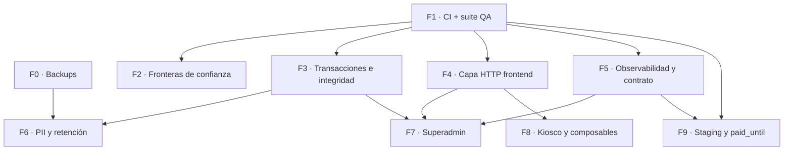

# Auditoría de arquitectura — Índice y plan de ejecución

Auditoría realizada el 2026-09-02 sobre `claude/frontend-architecture-review-vn2ko9`.
Cubre las cuatro capas del sistema. Este documento es el índice y el plan: los
hallazgos viven en los cuatro documentos de abajo y aquí solo se ordenan.

## Documentos

| Documento | Alcance | Hallazgos |
|---|---|---|
| [FRONTEND.md](FRONTEND.md) | `frontend/src/` (18.724 líneas) y su directiva | FE-1 … FE-7 |
| [BACKEND.md](BACKEND.md) | `backend/app/` (6.858 líneas), tests, stack | BE-1 … BE-8 |
| [DATABASE.md](DATABASE.md) | Esquema, 26 migraciones, uso desde el código | DB-1 … DB-8 |
| [SYSTEM.md](SYSTEM.md) | Topología, contratos, fronteras, operación | SYS-1 … SYS-7 |

`BACKEND.md` cierra con la evaluación de stack (¿Python y FastAPI son lo
correcto?). `SYSTEM.md` cierra con los tres patrones que se repiten en las tres
capas.

---

## Cómo leer el orden

El plan se ordena por tres ejes distintos. No son sinónimos y a veces apuntan en
direcciones opuestas.

- **Prioridad (P0-P3):** cuánto daño evita o cuánto valor desbloquea. P0 es
  pérdida irreversible o bloqueo de todo lo demás.
- **Urgencia (U0-U3):** en qué ventana hay que hacerlo, con independencia de la
  prioridad. Algo puede ser P1 y U3 (importante pero puede esperar), o P2 y U0
  (menor pero se abarata muchísimo si se hace ya).
- **Dependencia:** qué fase debe estar terminada antes. Es el eje que manda: una
  fase P0 que depende de otra no puede adelantarse.

El orden de ejecución de la tabla resuelve los tres: respeta dependencias
primero, y dentro de lo que está desbloqueado ordena por prioridad y luego por
urgencia.

---

## Plan de ejecución

| # | Fase | Hallazgos | P | U | Depende de | Esfuerzo |
|---|---|---|---|---|---|---|
| F0 | Backups y restauración probada | SYS-1 | P0 | U0 | — | bajo |
| F1 | CI + rescate de la suite QA | BE-1, FE-5, SYS-2, SYS-3 | P0 | U0 | — | bajo |
| F2 | Cierre de fronteras de confianza | SYS-5, BE-6 | P0 | U0 | F1 | bajo |
| F3 | Transacciones e integridad de la cola | BE-2, DB-2, DB-3 | P0 | U1 | F1 | medio |
| F4 | Capa HTTP única en el frontend | FE-1, FE-2, FE-3 | P1 | U1 | F1 | medio |
| F5 | Observabilidad y contrato tipado | BE-3, SYS-4, BE-7 | P1 | U2 | F1 | medio |
| F6 | Retención de PII y borrado | DB-5 | P1 | U2 | F0, F3 | medio |
| F7 | Superadmin: capa de servicios y estado operativo | BE-4, BE-5 | P2 | U2 | F3, F4, F5 | alto |
| F8 | Kiosco: modelo de fallo y composables | SYS-6, FE-4, FE-6, FE-7 | P2 | U3 | F4 | alto |
| F9 | Consolidación: staging y `paid_until` derivado | SYS-7, DB-7 | P2 | U3 | F1, F5 | medio |
| — | **Bloqueados por decisión de producto** | DB-1, DB-4, DB-6 | ver abajo | — | decisión | — |

Los hallazgos menores BE-8 y DB-8 (numeración de migraciones duplicada, columna
muerta, índice redundante, `docs/DATA_MODEL.md` desactualizado) no tienen fase
propia: se resuelven de paso en la fase que toque su archivo.

### Grafo de dependencias

F0 y F1 no dependen de nada y se pueden hacer en paralelo. Todo lo demás cuelga
de F1.

---

## Detalle por fase

### F0 · Backups y restauración probada — P0 / U0

**Cubre:** [SYS-1](SYSTEM.md#sys-1--sin-backups-el-ledger-de-facturación-vive-en-un-archivo-sin-copia)

Tarea programada con `VACUUM INTO` (consistente con WAL), transferencia a
almacenamiento externo, política de retención y **una restauración probada**.
Actualizar `docs/DEPLOYMENT.md` §Backups quitando el bloque PENDIENTE.

Va primero porque todo lo demás asume que los datos existen, y porque es el
único riesgo del sistema que no se puede deshacer.

**Decisión requerida:** destino de la copia externa (S3, Backblaze, `rsync` a
otro servidor).

### F1 · CI + rescate de la suite QA — P0 / U0

**Cubre:** [BE-1](BACKEND.md#be-1--sin-ci-y-main-es-deploy-directo-a-producción),
[FE-5](FRONTEND.md#fe-5--la-pirámide-de-tests-está-invertida),
[SYS-2](SYSTEM.md#sys-2--el-proyecto-usa-documentación-donde-debería-usar-verificación),
[SYS-3](SYSTEM.md#sys-3--el-esfuerzo-de-testing-ya-existe-pero-está-fuera-del-circuito)

1. `backend/pyproject.toml` con `ruff`, `mypy` y `pytest` configurados.
2. Workflow de GitHub Actions: backend (pytest, ruff, mypy) y frontend
   (`npm test`, `npm run build`) en cada PR.
3. Portar `scripts/qa_bug_hunt.py` (601 líneas) a pytest con `ASGITransport`,
   siguiendo `backend/tests/test_wompi_webhook.py:15-17`.
4. Corregir la pirámide del frontend (FE-5): primeros tests de stores, services
   y guards del router, hoy sin cobertura. Los tests de composables llegan con
   F8, cuando estén partidos.

Es la fase de mayor palanca: convierte tres directivas escritas en reglas que
fallan el build, y multiplica la cobertura sin escribir tests nuevos.

### F2 · Cierre de fronteras de confianza — P0 / U0

**Cubre:** [SYS-5](SYSTEM.md#sys-5--el-kiosco-no-tiene-frontera-de-confianza),
[BE-6](BACKEND.md#be-6--apisuperadminlogin-no-tiene-rate-limiting)

Exigir token en `/api/playback/finished` y `/error` (el kiosco ya lo manda:
cambio de una línea por endpoint). Token de kiosco para `/fallback-playing`.
`Depends(limit_auth_attempts)` en `/api/superadmin/login` y evicción de claves
en `_attempts`.

Esfuerzo bajo, severidad alta: es la mejor relación de todo el plan.

**Decisión requerida:** ¿hay kioscos en producción con versión cacheada que
dependan de la vía anónima?

### F3 · Transacciones e integridad de la cola — P0 / U1

**Cubre:** [BE-2](BACKEND.md#be-2--dbcommit-no-hace-nada-45-llamadas-dan-falsa-atomicidad),
[DB-2](DATABASE.md#db-2--la-cola-no-tiene-garantía-de-orden),
[DB-3](DATABASE.md#db-3--el-borrado-de-venue-son-10-delete-sueltos-sin-transacción)

Helper `async with transaction(db)` con `BEGIN IMMEDIATE` / `COMMIT` /
`ROLLBACK`, aplicado a `complete_onboarding`, `add_song`, `reorder_song` y
`delete_venue`. Índice `UNIQUE(venue_id, position) WHERE status = 'pending'`.
`ON DELETE CASCADE` en las FKs hacia `venues` (reconstrucción de tablas, patrón
de `024`) y `delete_venue` reducido a un solo `DELETE`.

Depende de F1: sin tests que corran solos, tocar transacciones es riesgo puro.

### F4 · Capa HTTP única en el frontend — P1 / U1

**Cubre:** [FE-1](FRONTEND.md#fe-1--no-existe-una-capa-http-existen-cinco),
[FE-2](FRONTEND.md#fe-2--25-fetch-en-vistas-y-componentes),
[FE-3](FRONTEND.md#fe-3--el-token-de-superadmin-no-tiene-dueño)

`src/services/http.js` con base URL, timeout/abort, contrato de error único e
interceptor 401. Migrar los cinco `request()`. Crear `services/superadmin.js` y
`services/adminAccount.js` y mover los 25 `fetch()`. Token de superadmin al
store, borrar las 6 copias de `headers()`.

**Decisión requerida:** contrato de error único — `{ok, data, error}` o
excepciones. Hoy conviven ambos y hay que elegir uno.

### F5 · Observabilidad y contrato tipado — P1 / U2

**Cubre:** [BE-3](BACKEND.md#be-3--50-except-exception-contra-8-líneas-de-logging),
[SYS-4](SYSTEM.md#sys-4--el-contrato-entre-los-tres-artefactos-solo-existe-en-prosa),
[BE-7](BACKEND.md#be-7--acceso-a-filas-por-índice-posicional)

Middleware de excepciones con request-id y logging estructurado; revisión de los
~50 `except Exception`. `response_model` en los endpoints que consume el
frontend, empezando por dashboard y kiosco. Acceso a filas por nombre en los
`SELECT` anchos.

Las tres cosas atacan la misma raíz: hoy un cambio puede alterar la respuesta de
la API sin que nada falle ni quede registrado.

### F6 · Retención de PII y borrado — P1 / U2

**Cubre:** [DB-5](DATABASE.md#db-5--pii-sin-modelo-de-retención-ni-ruta-de-borrado)

Ruta de borrado de usuario (anonimizar `play_history` conservando el agregado,
borrar `users`) y política de retención explícita para usuarios inactivos.
Alineado con la política de privacidad ya publicada y con la Ley 1581 de 2012.

Depende de F0 (no se borra en masa sin copia) y de F3 (el borrado debe ser
atómico).

### F7 · Superadmin: capa de servicios y estado operativo — P2 / U2

**Cubre:** [BE-4](BACKEND.md#be-4--la-capa-de-servicios-existe-a-medias-126-sentencias-sql-en-routers),
[BE-5](BACKEND.md#be-5--venuesconfig-es-un-blob-json-usado-como-estado-mutable-compartido)

`services/superadmin_service.py` y `services/venue_service.py`; mover las 126
sentencias SQL fuera de los routers. Migrar el estado operativo (`volume`,
`banner_text`, `show_qr`, `qr_size`, `show_brand`, `playback_status`) de
`config` JSON a columnas propias, eliminando las 6 copias del
read-modify-write.

Se hace tarde a propósito: con CI, transacciones, capa HTTP y contrato tipado
detrás, es refactor rutinario en vez de cirugía.

### F8 · Kiosco: modelo de fallo y composables — P2 / U3

**Cubre:** [SYS-6](SYSTEM.md#sys-6--falta-un-modelo-de-fallo-del-kiosco),
[FE-4](FRONTEND.md#fe-4--useadmindashboardjs-es-la-vista-disfrazada-de-composable),
[FE-6](FRONTEND.md#fe-6--kioskvue-tiene-la-dependencia-invertida),
[FE-7](FRONTEND.md#fe-7--estado-de-servidor-sin-disciplina-de-caché)

Heartbeat del kiosco con TTL para que el backend detecte su ausencia y libere la
canción trabada. Invertir el acoplamiento de `useKioskPlayback` (emite
intenciones, la vista ejecuta). Partir `useAdminDashboard` en cuatro composables
con sus tests. Refetch con dedupe y cancelación.

### F9 · Consolidación: staging y `paid_until` derivado — P2 / U3

**Cubre:** [SYS-7](SYSTEM.md#sys-7--push-a-main-es-deploy-a-producción-sin-staging),
[DB-7](DATABASE.md#db-7--venuespaid_until-es-caché-derivada-del-ledger-mantenida-a-mano)

Entorno de pre-producción antes de `main`. `recompute_paid_until(venue_id)`
derivada del ledger, con test de invariante.

---

## Bloqueados por decisión de producto

No están en la tabla de ejecución porque no dependen de otra fase sino de una
respuesta. Dos de ellos son P1: **la decisión es el trabajo pendiente, no el
código.**

| Hallazgo | P | Decisión requerida |
|---|---|---|
| [DB-1](DATABASE.md#db-1--blocked_videos-rompe-el-aislamiento-entre-bares) | P1 | ¿El bloqueo de un video es por bar o global? Hoy el código dice una cosa y el índice otra, y un bar bloquea para toda la plataforma. |
| [DB-4](DATABASE.md#db-4--no-existe-el-concepto-de-zona-horaria) | P1 | ¿Habrá bares fuera de Colombia en los próximos meses? Si no, basta con corregir el KPI "hoy" del panel superadmin y baja a P3. |
| [DB-6](DATABASE.md#db-6--los-metadatos-de-canción-viven-en-tres-tablas) | P2 | Cuando un video cambia de título en YouTube, ¿el historial debe mostrar el título de entonces o el actual? Eso decide si la duplicación es bug o decisión. |

---

## Resumen ejecutivo

Las tres capas están bien diseñadas y muy bien documentadas. El problema no es
el diseño: es que **nada obliga a cumplirlo**. La misma causa produce las 25
violaciones de la directiva en el frontend, las 126 sentencias SQL en los
routers del backend y la documentación de datos desactualizada.

Por eso el plan empieza por F0 y F1: la copia de seguridad que hoy no existe, y
el circuito de verificación que convierte 4.398 líneas de documentación en
reglas que fallan el build. Con esas dos fases hechas, el resto del plan pasa de
ser cirugía a ser mantenimiento.
