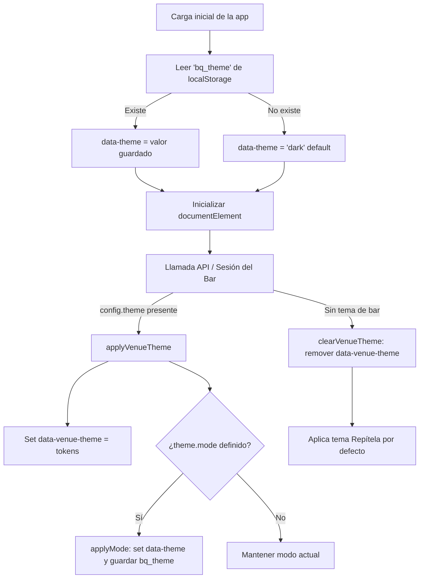

# Sistema de Diseño y Temas (Frontend App)

> **Índice:** [[README]] · **Autoridad sobre:** temas, tokens y logo · **Últ. cambio:** 2026-09-01
> Si esta página contradice al código, gana el código y esta página tiene un bug.

Este documento describe la arquitectura, los tokens de diseño, el catálogo de temas y los mecanismos de aplicación visual de la aplicación web de BarQueue (`frontend/`).

> **Nota sobre el alcance:**  
> Este documento aplica exclusivamente a la **aplicación cliente/admin** (`frontend/`). La landing page promocional (`landing/`) utiliza un stack separado (Astro) documentado en [`docs/diseno-landing.md`](diseno-landing.md).

---

## 1. Arquitectura y Aplicación de Temas

El sistema visual de la app se basa en **Custom Properties de CSS** (variables CSS) aplicadas reactivamente sobre el elemento raíz `<html>` a través de dos atributos HTML principales:

| Atributo | Valores Posibles | Responsabilidad |
|---|---|---|
| `data-theme` | `dark` \| `light` | Controla el modo claro u oscuro global. |
| `data-venue-theme` | Identificador de tokens (ej. `craft`, `purple-night`, `red-fire`) | Define la paleta de colores personalizada del bar/establecimiento. Si no está presente, rige el tema por defecto **Repítela**. |

### Flujo de Resolución en Runtime (`useTheme.js`)

El composable [`frontend/src/composables/useTheme.js`](../frontend/src/composables/useTheme.js) encapsula el estado y la lógica de activación:



### Ciclo de vida y persistencia

1. **Inicialización de modo:** Al cargar la app, se lee `localStorage.getItem('bq_theme')` mediante llamadas protegidas contra entornos con restricciones (`safeGetItem`/`safeSetItem` para navegación privada). Si no existe valor previo, el modo por defecto es `dark`.
2. **Asignación del bar:** Cuando un usuario escanea un QR o el administrador se autentica, las vistas (`CustomerDashboard.vue`, `AdminDashboard.vue`, `Kiosk.vue`, `QRLanding.vue`, `AdminLogin.vue`) llaman a `applyVenueTheme(config)`.
3. **Parseo de configuración:** `applyVenueTheme` acepta tanto un objeto de configuración como un string JSON serializado proveniente del backend (`theme.tokens` o `theme.preset`).
4. **Prioridad CSS:** Al no usar `:root` en los archivos de bar sino selectores de atributo plano `[data-venue-theme="..."]`, cualquier tema de bar tiene mayor especificidad y prevalece sobre la paleta por defecto definida en `default.css`.
5. **Limpieza:** La función `clearVenueTheme()` remueve el atributo `data-venue-theme`, restaurando instantáneamente la apariencia por defecto de Repítela.

---

## 2. Catálogo de Temas (`themePresets.js`)

El catálogo oficial de presets de la app está declarado en [`frontend/src/constants/themePresets.js`](../frontend/src/constants/themePresets.js). Consta de 12 configuraciones:

| ID del Preset | Nombre | Archivo de Tokens | Color de Acento | Modo por Defecto | Fondo Representativo | Texto Representativo |
|---|---|---|---|---|---|---|
| `purple-night` | Noche Morada | `purple-night` | `#6C5CE7` | `dark` | `#0F0F1A` | `#EAEAEA` |
| `red-fire` | Fuego Rojo | `red-fire` | `#E74C3C` | `dark` | `#1A0F0F` | `#EAEAEA` |
| `green-jungle` | Selva Verde | `green-jungle` | `#00B894` | `dark` | `#0F1A15` | `#EAEAEA` |
| `blue-ocean` | Oceano Azul | `blue-ocean` | `#0984E3` | `dark` | `#0F131A` | `#EAEAEA` |
| `gold-elegance` | Elegancia Dorada | `gold-elegance` | `#F39C12` | `dark` | `#1A170F` | `#EAEAEA` |
| `craft-dark` | Artesanal Oscuro | `craft` | `#D2B56F` | `dark` | `#12100E` | `#FFF8E9` |
| `purple-light` | Morado Claro | `purple-light` | `#6C5CE7` | `light` | `#F4F4F8` | `#1A1A2E` |
| `red-light` | Rojo Claro | `red-light` | `#E74C3C` | `light` | `#FDF4F4` | `#1A1A2E` |
| `green-light` | Verde Claro | `green-light` | `#00B894` | `light` | `#F0FAF7` | `#1A1A2E` |
| `blue-light` | Azul Claro | `blue-light` | `#0984E3` | `light` | `#F0F6FD` | `#1A1A2E` |
| `gold-light` | Dorado Claro | `gold-light` | `#F39C12` | `light` | `#FDFAF0` | `#1A1A2E` |
| `craft-light` | Artesanal Claro | `craft` | `#5C3A26` | `light` | `#F7EFDD` | `#33241A` |

---

## 3. Tokens de Diseño (CSS Variables)

El archivo de referencia fundamental para los tokens temáticos es [`frontend/src/themes/default.css`](../frontend/src/themes/default.css).

Los tokens se dividen en **Tokens Base** (fuente de verdad prefijada con `--color-*` y variantes soft) y **Alias de Compatibilidad** (para interoperabilidad con estilos heredados en componentes).

### 3.1 Tokens Base por Familia

#### Fondos y Superficies
| Token | Uso / Propósito |
|---|---|
| `--color-background` | Fondo principal del viewport y contenedor general. |
| `--color-surface` | Fondo de tarjetas (`.card`), paneles y secciones contenidas. |
| `--color-surface-elevated` | Fondo para modales, menús flotantes, inputs y botones secundarios. |
| `--color-border` | Bordes principales, divisores y líneas de separación estructural. |

#### Tipografía y Textos
| Token | Uso / Propósito |
|---|---|
| `--color-text` | Color del texto principal (títulos, cuerpo, elementos de alta jerarquía). |
| `--color-text-muted` | Color para texto secundario, metadatos, subtítulos y placeholders. |

#### Marca y Acciones
| Token | Uso / Propósito |
|---|---|
| `--color-primary` | Color primario de marca y botones principales (`.btn-primary`). |
| `--color-on-primary` | Color del texto o icono ubicado sobre una superficie `--color-primary`. |
| `--color-primary-hover` | Estado hover / active de las acciones primarias. |
| `--color-secondary` | Color de marca secundario o acciones de soporte. |
| `--color-on-secondary` | Color del texto o icono ubicado sobre una superficie `--color-secondary`. |
| `--color-secondary-hover` | Estado hover de acciones secundarias. |
| `--color-accent` | Acento visual para badges, detalles llamativos y destacados. |
| `--color-on-accent` | Color del texto ubicado sobre una superficie `--color-accent`. |

#### Estados Semánticos
| Token | Uso / Propósito |
|---|---|
| `--color-success` | Indicadores de éxito, confirmaciones o canciones aceptadas. |
| `--color-on-success` | Texto e iconos sobre superficies de éxito. |
| `--color-warning` | Avisos de advertencia, estados pendientes o alertas. |
| `--color-on-warning` | Texto e iconos sobre superficies de advertencia. |
| `--color-error` | Errores críticos, fallos y acciones destructivas (`.btn-danger`). |
| `--color-on-error` | Texto e iconos sobre superficies de error. |
| `--color-info` | Mensajes informativos y badges de estado informativo. |
| `--color-on-info` | Texto e iconos sobre superficies informativas. |

#### Interacción, Foco y Accesibilidad
| Token | Uso / Propósito |
|---|---|
| `--color-link` | Color de enlaces de texto clicables con contraste accesible garantizado. |
| `--color-focus` | Anillo de enfoque accesible para teclado (`:focus-visible`). |
| `--color-disabled` | Color para elementos desactivados o estados inhabilitados. |

#### Fondos Suaves y Sombras
| Token | Uso / Propósito |
|---|---|
| `--primary-soft` | Fondo tintado suave con baja opacidad del color primario. |
| `--secondary-soft` | Fondo tintado suave con baja opacidad del color secundario. |
| `--accent-soft` | Fondo tintado suave con baja opacidad del color de acento. |
| `--success-soft` | Fondo tintado suave para badges y alertas de éxito. |
| `--warning-soft` | Fondo tintado suave para badges y alertas de advertencia. |
| `--danger-soft` | Fondo tintado suave para badges y alertas de error/peligro. |
| `--border-soft` | Borde sutil semi-transparente para tarjetas y separadores delicados. |
| `--shadow` | Sombra difusa para elevación de tarjetas y paneles. |
| `--shadow-glow-primary` | Efecto de resplandor (glow) en botones y tarjetas destacadas. |

### 3.2 Alias de Mapeo (Consumo en Componentes)

Para mantener retrocompatibilidad con las referencias existentes en los componentes de Vue sin renombrar cientos de clases, cada archivo de tema incluye un bloque de alias:

| Alias | Mapeado a Token Base |
|---|---|
| `--bg` | `var(--color-background)` |
| `--bg-card` | `var(--color-surface)` |
| `--bg-elevated` | `var(--color-surface-elevated)` |
| `--border` | `var(--color-border)` |
| `--text` | `var(--color-text)` |
| `--text-muted` | `var(--color-text-muted)` |
| `--primary` | `var(--color-primary)` |
| `--primary-dark` | `var(--color-primary-hover)` |
| `--primary-foreground` | `var(--color-on-primary)` |
| `--text-on-primary` | `var(--color-on-primary)` |
| `--secondary` | `var(--color-secondary)` |
| `--accent` | `var(--color-accent)` *(en craft.css mapea a `--color-info`)* |
| `--success` | `var(--color-success)` |
| `--warning` | `var(--color-warning)` |
| `--danger` | `var(--color-error)` |

---

## 4. Tokens Fijos e Invariables (`style.css`)

Aquellos valores estructurales que no varían con el tema del bar residen en [`frontend/src/style.css`](../frontend/src/style.css):

### 4.1 Radios de Borde
| Token | Valor | Uso |
|---|---|---|
| `--radius-sm` | `8px` | Botones, inputs, badges y toggle switches. |
| `--radius` | `12px` | Tarjetas estándar (`.card`), toasts y contenedores modulares. |
| `--radius-lg` | `16px` | Modales grandes y paneles principales. |

### 4.2 Tokens de Modo Kiosko
| Token | Modo Oscuro | Modo Claro | Uso |
|---|---|---|---|
| `--kiosk-bg` | `#000000` | `#000000` | Fondo negro fijo para pantalla de kiosko / TV. |
| `--kiosk-text-dim` | `#999999` | `#888888` | Texto atenuado secundario en kiosko. |
| `--kiosk-text-dimmer` | `#666666` | `#666666` | Texto terciario de baja jerarquía en kiosko. |
| `--kiosk-dot` | `#FF5522` | `#FF5522` | Indicador de estado / punto pulsante en kiosko. |

### 4.3 Tipografía
| Familia Tipográfica | Origen / Archivo | Pesos | Uso |
|---|---|---|---|
| **Plus Jakarta Sans** | `@font-face` (`assets/fonts/plus-jakarta-sans-latin.woff2`) | 500 – 800 | Títulos principales, display y encabezados paywall (`.font-display`). |
| **Inter** | Sistema / Web font (`-apple-system, BlinkMacSystemFont, sans-serif`) | 400, 600, 700 | Cuerpo de texto, botones, inputs y UI interactiva. |

---

## 5. Guía: Cómo Agregar un Tema Nuevo

Para incorporar un nuevo tema al sistema, se sigue este procedimiento de 4 pasos:

### Paso 1: Crear el archivo CSS
Crear `frontend/src/themes/<nuevo-tema>.css`. Debe contener las definiciones de modo claro, modo oscuro y el bloque de alias.

> **Regla Crítica de Selectores:**  
> Usar selectores de atributo plano `[data-venue-theme="<nuevo-tema>"]` **sin anteponer `:root`**. Esto permite que el tema aplique tanto al documento completo (`<html>`) como a contenedores aislados (`<div data-venue-theme="...">`).

```css
/* ==========================================================================
   TEMA MI NUEVO TEMA
   ========================================================================== */

/* MODO CLARO */
[data-venue-theme="mi-tema"],
[data-venue-theme="mi-tema"][data-theme="light"] {
  color-scheme: light;

  --color-background: #f8f9fa;
  --color-surface: #ffffff;
  --color-surface-elevated: #e9ecef;
  --color-border: #ced4da;

  --color-text: #212529;
  --color-text-muted: #6c757d;

  --color-primary: #0d6efd;
  --color-on-primary: #ffffff;
  --color-primary-hover: #0b5ed7;

  --color-secondary: #6c757d;
  --color-on-secondary: #ffffff;
  --color-secondary-hover: #5c636a;

  --color-accent: #0dcaf0;
  --color-on-accent: #000000;

  --color-success: #198754;
  --color-on-success: #ffffff;

  --color-warning: #ffc107;
  --color-on-warning: #000000;

  --color-error: #dc3545;
  --color-on-error: #ffffff;

  --color-info: #0dcaf0;
  --color-on-info: #000000;

  --color-link: #0d6efd;
  --color-focus: #0d6efd;
  --color-disabled: #adb5bd;

  --primary-soft: rgba(13, 110, 253, 0.10);
  --secondary-soft: rgba(108, 117, 125, 0.10);
  --accent-soft: rgba(13, 202, 240, 0.10);
  --success-soft: rgba(25, 135, 84, 0.10);
  --warning-soft: rgba(255, 193, 7, 0.10);
  --danger-soft: rgba(220, 53, 69, 0.10);
  --border-soft: rgba(33, 37, 41, 0.10);
  --shadow: rgba(0, 0, 0, 0.08);
  --shadow-glow-primary: 0 0 30px rgba(13, 110, 253, 0.20);
}

/* MODO OSCURO */
[data-venue-theme="mi-tema"][data-theme="dark"] {
  color-scheme: dark;

  --color-background: #121212;
  --color-surface: #1e1e1e;
  --color-surface-elevated: #2d2d2d;
  --color-border: #495057;

  --color-text: #f8f9fa;
  --color-text-muted: #adb5bd;

  --color-primary: #3d8bfd;
  --color-on-primary: #121212;
  --color-primary-hover: #6ea8fe;

  --color-secondary: #adb5bd;
  --color-on-secondary: #121212;
  --color-secondary-hover: #ced4da;

  --color-accent: #6edff6;
  --color-on-accent: #121212;

  --color-success: #75b798;
  --color-on-success: #121212;

  --color-warning: #ffda6a;
  --color-on-warning: #121212;

  --color-error: #ea868f;
  --color-on-error: #121212;

  --color-info: #6edff6;
  --color-on-info: #121212;

  --color-link: #3d8bfd;
  --color-focus: #3d8bfd;
  --color-disabled: #495057;

  --primary-soft: rgba(61, 139, 253, 0.16);
  --secondary-soft: rgba(173, 181, 189, 0.16);
  --accent-soft: rgba(110, 223, 246, 0.16);
  --success-soft: rgba(117, 183, 152, 0.16);
  --warning-soft: rgba(255, 218, 106, 0.16);
  --danger-soft: rgba(234, 134, 143, 0.16);
  --border-soft: rgba(248, 249, 250, 0.12);
  --shadow: rgba(0, 0, 0, 0.50);
  --shadow-glow-primary: 0 0 30px rgba(61, 139, 253, 0.25);
}

/* MAPEO DE COMPATIBILIDAD */
[data-venue-theme="mi-tema"] {
  --bg: var(--color-background);
  --bg-card: var(--color-surface);
  --bg-elevated: var(--color-surface-elevated);
  --border: var(--color-border);
  --text: var(--color-text);
  --text-muted: var(--color-text-muted);
  --primary: var(--color-primary);
  --primary-dark: var(--color-primary-hover);
  --primary-foreground: var(--color-on-primary);
  --text-on-primary: var(--color-on-primary);
  --secondary: var(--color-secondary);
  --accent: var(--color-accent);
  --success: var(--color-success);
  --warning: var(--color-warning);
  --danger: var(--color-error);
}
```

### Paso 2: Importar en `main.js`
En [`frontend/src/main.js`](../frontend/src/main.js), añadir la importación debajo del resto de temas:
```javascript
import './themes/default.css'
import './themes/craft.css'
// ...
import './themes/mi-tema.css'
```

### Paso 3: Registrar en el catálogo `themePresets.js`
En [`frontend/src/constants/themePresets.js`](../frontend/src/constants/themePresets.js), agregar el objeto descriptivo al array `THEME_PRESETS`:
```javascript
{
  id: 'mi-tema',
  name: 'Mi Tema Personalizado',
  tokens: 'mi-tema',
  accent: '#0d6efd',
  mode: 'dark', // o 'light'
  colors: { bg: '#121212', text: '#f8f9fa' },
}
```

### Paso 4: Disponibilidad automática en Storybook
Debido a que [`.storybook/preview.js`](../frontend/.storybook/preview.js) utiliza `import.meta.glob('../src/themes/*.css', { eager: true })` y mapea directamente `THEME_PRESETS`, el nuevo tema estará disponible inmediatamente en el toolbar de Storybook sin configuración adicional.

---

## 6. Visualización y Validación en Storybook

Storybook sirve como el entorno interactivo de documentación y validación de tokens y componentes.

### Ejecución
```bash
cd frontend
npm run storybook
```
Disponible en local en `http://localhost:6006`.

### Controles de la Toolbar Global
- **Selector de Tema (`venueTheme`):** Permite alternar en tiempo real entre el tema base `Default` (Repítela) y cualquiera de los 12 presets de bar.
- **Selector de Modo (`mode`):** Permite forzar el modo `dark` o `light`.

### Página Foundations
Ubicada en `Foundations > Foundations` ([`frontend/src/foundations.stories.js`](../frontend/src/foundations.stories.js)):
- Lee dinámicamente los valores calculados de las variables CSS (`getComputedStyle`) reaccionando a los cambios en `data-theme` y `data-venue-theme` mediante un `MutationObserver`.
- Muestra una grilla visual con muestras de color, identificadores de token y valores hexadecimales o rgba reales.
- Incluye indicadores `MISSING TOKEN` en caso de que algún preset omita una variable obligatoria.
- Muestra la escala tipográfica y los radios de borde computados.

### Trampas conocidas de Storybook

Cuatro errores reales que costaron horas al montarlo. Los cuatro **pasaron `npm run build`, `npm run build-storybook` y los tests en verde**: compilar no es renderizar, y la única forma de detectarlos fue abrir las stories en el navegador y leer la consola.

| Síntoma | Causa | Solución |
|---|---|---|
| Un componente revienta al montar, con el build en verde | `setup` declarado como **clave del objeto `preview`**. En Vue 3 es un **export de `@storybook/vue3`**, así que se ignora y Pinia/router nunca se instalan | `import { setup } from '@storybook/vue3'` y llamarlo a nivel de módulo |
| `<RouterLink :to="{ name }">` tira `No match` | El router de memoria tenía solo un catch-all sin nombres | `src/router/index.js` exporta su array `routes` y `preview.js` monta el router con **las rutas reales** |
| El toolbar dice `light` pero la página se ve `dark` | Los componentes que llaman `useTheme()` **reescriben `data-theme` al montar** desde su propio ref | El decorator usa `useTheme().applyMode(mode)`, que mueve el ref y el atributo juntos — no `setAttribute` |
| `globals.mode` llega `undefined` sin `?globals=` en la URL | `defaultValue` dentro de `globalTypes` está **removido desde Storybook 8** y se ignora sin warning | `initialGlobals: { venueTheme: 'default', mode: 'dark' }` en el `preview` |

Dos de los cuatro son cambios de API entre mayores de Storybook que **fallan en silencio**. Ante cualquier cosa que "debería andar" en `preview.js`, verificar contra la documentación de la versión instalada antes que releer el código.

### Convenciones de las stories

- Una story es **un estado que alguien va a mirar**, no la matriz completa de props.
- Barras, layouts y páginas llevan `parameters: { layout: 'fullscreen' }`: el padding por defecto de `.sb-main-padded` les inventa un margen que en la app no existe.
- Los cambios en `.storybook/preview.js` no siempre entran por HMR. Si algo no se actualiza, recargar con **hard reload**.

---

## 7. Decisiones de Contraste y Accesibilidad

Las decisiones de color del sistema balancean la accesibilidad WCAG 2.2 con la fidelidad a la identidad de marca:

| Elemento | Decisión de Color | Ratio de Contraste | Razón / Justificación de Diseño |
|---|---|---|---|
| **Botón Primario (Default)** | Texto Blanco `#FFFFFF` sobre Naranja `#FF5522` | **3.19:1** (bajo AA) | **Decisión consciente de marca.** Mantiene fidelidad absoluta con la landing (`--primary-foreground` sobre `--primary`). **No debe alterarse** a texto negro ni oscurecer el fondo del botón. |
| **Enlaces de Texto (`--color-link`) en Light** | Naranja oscurecido `#C43A0F` sobre fondo `#F5F5FA` | **4.6:1** (supera AA) | `#FF5522` en texto sobre fondo claro da sólo 3.0:1. Para enlaces de texto interactivo se utiliza deliberadamente una variante oscurecida accesible. |
| **Color Secundario Dark (`--color-on-secondary`)** | Blanco `#FFFFFF` sobre Violeta `#A855F7` | **3.96:1** | Fidelidad con la paleta de la landing page. |
| **Temas por Bar (`craft`, `purple-night`, etc.)** | Botones con texto contrastado (`--color-on-primary` oscuro sobre acentos claros en dark) | **≥ 4.5:1** (texto) / **≥ 3.0:1** (bordes/UI) | Diseñados con ratios estrictos y probados de antemano para alta legibilidad en ambientes nocturnos o de bar. |

---

## 8. Identidad Visual: Logo y Favicons

### 8.1 Variantes del Logo de Repítela (`frontend/src/assets/`)

Los assets vectoriales oficiales del isotipo + logotipo viven en [`frontend/src/assets/`](../frontend/src/assets/). Todos comparten las mismas dimensiones maestras: `viewBox="0 0 839.32 188.71"` (ratio ~4.45:1).

| Archivo | Relleno Real (`fill`) | Fondo Destino | Tipo | Caso de Uso Principal |
|---|---|---|---|---|
| `logo-color-sobre-oscuro.svg` | Isotipo con gradiente (`#fb1014` → `#fe5d02`) + texto `.cls-2 { fill: #fff; }` | **Fondo Oscuro** | Color | Login y páginas informativas en modo oscuro (`currentMode === 'dark'`). |
| `logo-color-sobre-claro.svg` | Isotipo con gradiente (`#fb1014` → `#fe5d02`) + texto `#000000` default | **Fondo Claro** | Color | Login y páginas informativas en modo claro (`currentMode === 'light'`). |
| `logo-sobre-oscuro.svg` | Todo el vector `.cls-1 { fill: #fff; }` (blanco plano) | **Fondo Oscuro** | Monocromo | Impresión monocromática sobre negro o interfaces de alto contraste oscuro. |
| `logo-sobre-claro.svg` | Todo el vector `.cls-1 { fill: #080808; }` (negro plano) | **Fondo Claro** | Monocromo | Impresión monocromática sobre blanco o fondos claros. Detectado por `VenueLogo` para inversión. |

### 8.2 Selección Dinámica en la App

[`RepitelaLogo.vue`](../frontend/src/components/RepitelaLogo.vue) centraliza la selección de la variante a color según el modo activo de [`useTheme.js`](../frontend/src/composables/useTheme.js):

- En `RepitelaLogo.vue`:
  ```javascript
  import logoSobreClaro from '../assets/logo-color-sobre-claro.svg'
  import logoSobreOscuro from '../assets/logo-color-sobre-oscuro.svg'

  const logoSrc = currentMode.value === 'dark' ? logoSobreOscuro : logoSobreClaro
  ```

### 8.3 Logo Corporativo vs. Logo del Bar

Es fundamental distinguir entre la identidad de la plataforma y la del establecimiento:

| Tipo de Logo | Origen | Componente Responsable | Comportamiento |
|---|---|---|---|
| **Logo de Repítela** | Assets estáticos locales (`assets/logo-color-sobre-*.svg`) | `` directo o fallback | Identidad global de la plataforma BarQueue / Repítela. |
| **Logo del Bar** | Configuración remota del bar (`auth.adminInfo?.config.logoUrl`, sesión o API) | [`frontend/src/components/VenueLogo.vue`](../frontend/src/components/VenueLogo.vue) | Identidad personalizada del establecimiento. Si `logoUrl` está presente, sustituye al de Repítela en formularios y vistas de marca. |

### 8.4 Logo del bar por tema (`VenueLogo.vue`)

> **Corregido el 2026-09-02.** Esta sección describía una heurística que **ya no
> existe en el código**: `utils/logo.js`, la función `isMonochromeDarkLogo()`, el
> muestreo en canvas y la clase CSS `.logo-adaptive`. Se retiraron y se
> reemplazaron por variantes explícitas. La versión anterior está en el
> historial de git si hace falta el porqué.

El bar sube **dos** logos —uno para fondo claro y otro para fondo oscuro— y se
elige el que toca. Se acabó adivinar analizando píxeles.

**Backend:** `venues.logo_url_light` y `venues.logo_url_dark`
(`022_venue_logo_variants.sql`).

**Frontend:** `VenueLogo.vue` lee `currentMode` de `useTheme()` y resuelve en
este orden:

1. `srcDark` si el modo es oscuro o si la prop `alwaysDark` está activa.
2. `srcLight` si el modo es claro.
3. La primera que exista, y como último recurso `src` (el logo único heredado).

`alwaysDark` existe porque **el kiosco va siempre sobre negro**, sin importar el
tema que el bar haya elegido para su panel.

**Por qué se cambió:** la heurística fallaba en silencio. Un logo casi monocromo
pero no del todo, o uno claro sobre transparente, caía del lado equivocado del
umbral y quedaba invisible en la pantalla del bar — sin error, sin aviso, y
detectable solo mirando. Dos columnas y una condición explícita hacen lo mismo
sin adivinar.

### 8.5 Catálogo en Storybook

El comportamiento de los logos y sus variantes se encuentra documentado en [`frontend/src/components/VenueLogo.stories.js`](../frontend/src/components/VenueLogo.stories.js) bajo `Components/VenueLogo`:

| Story | Qué Valida / Demuestra |
|---|---|
| `Variantes` | Muestra en grilla interactiva las 4 variantes de Repítela (`logo-color-sobre-oscuro`, `logo-color-sobre-claro`, `logo-sobre-oscuro`, `logo-sobre-claro`) con sus casos de uso. |
| `KioskAlwaysDark` | Demuestra el funcionamiento de la prop `always-dark` (`alwaysDark: true`) sobre fondo `#000000`, forzando la inversión a blanco sin importar el modo global. |
| `SinLogo` | Valida que cuando la prop `src` está vacía o nula, el componente no renderiza elementos DOM, permitiendo al contenedor decidir el fallback. |

### 8.6 Favicons y Assets PWA (`frontend/public/`)

Los iconos de la aplicación web y accesos directos PWA residen en [`frontend/public/`](../frontend/public/):

| Archivo | Formato / Dimensiones | Propósito / Dispositivo |
|---|---|---|
| `favicon.svg` | SVG vectorial (`viewBox="-20 -10 208.71 208.71"`) | Favicon moderno y nítido para navegadores con soporte vectorial SVG. Utiliza el gradiente oficial de marca. |
| `favicon-32x32.png` | PNG (32×32) | Favicon estándar para pestañas en navegadores de escritorio. |
| `favicon-96x96.png` | PNG (96×96) | Favicon de alta resolución para navegadores y marcadores. |
| `apple-touch-icon.png` | PNG (180×180) | Icono para la pantalla de inicio en iOS (iPhone / iPad / Safari). |
| `pwa-192x192.png` | PNG (192×192, `purpose: 'any'`) | Icono estándar para la pantalla de inicio en Android / Chrome PWA. |
| `pwa-512x512.png` | PNG (512×512, `purpose: 'any'`) | Icono de alta densidad para Splash Screen de PWA y pantallas de instalación. |
| `pwa-maskable-512x512.png` | PNG (512×512, `purpose: 'maskable'`) | Icono adaptable con zona de seguridad (safe zone) para máscaras circulares o adaptativas en Android. |

> **Pantalla de Carga (Splash Screen):**  
> [`frontend/index.html`](../frontend/index.html) incluye un elemento `#splash` con fondo `#07070B` y el isotipo SVG embebido para una presentación instantánea sin saltos visuales mientras cargan los scripts de Vue.
